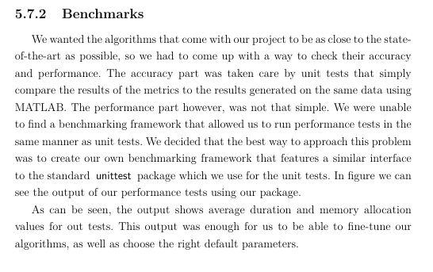
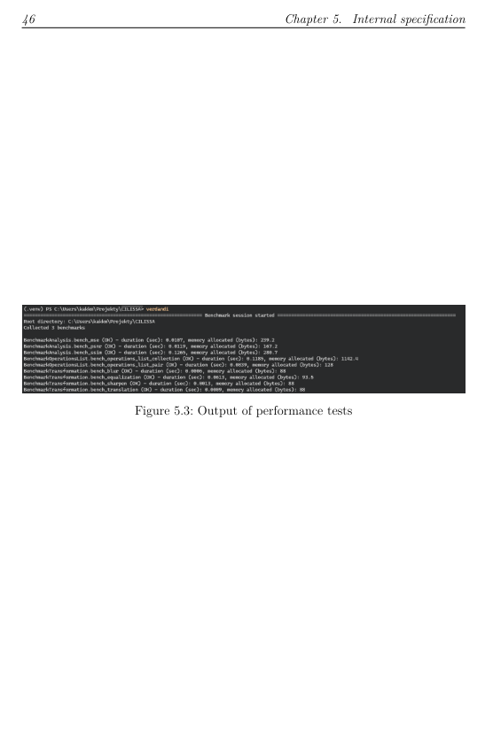

# Demystifying Python Modules and Imports

Created by [Kamil Marut](https://kamilmarut.com)

<!--
Hi everyone, my name's Kamil. 

This presentation is technically going to be about Python modules, but in reality, it will be about a side-quest that I went on when writing my bachelor's thesis.
-->

---
layout: default
---

<div class="flex flex-row items-center justify-center gap-4">
  <h1>The Story of How I Deep Dived into Python Modules</h1>
  
</div>

<!--

* Wrote a Python app to compare the accuracy of different image similarity algorithms
* Noticed I was a couple of pages short
* "Why not also compare the performance of algorithms?"
* Tried to find a benchmarking library
* Had a huge preference for unittest over pytest (because of the simplicity of TestCase)
* Didn't find anything that matched my preference
* Wanted to build a clone of unittest for performance tests
* Had no idea how to dynamically import modules
* Didn't understand how the import statement worked
* Had to find out

During my bachelor's thesis I wrote a Python app to compare the accuracy of different image similarity algorithms. When it was close to the deadline, I noticed I was a couple of pages short. So I had to fill it with something, right? So I thought "why not also compare the performance of algorithms?". So I tried to find some benchmarking library that I could use in my project. At that time I also had a huge preference for the unittest library over pytest, because I just liked how simple it was to inherit from TestCase and to use the setUp and tearDown methods instead of using fixtures. Don't worry, at some point I grew up and understood how powerful pytest is. But anyway, I didn't find anything that matched my preference and so the younger me wanted to build a clone of unittest for performance tests. The problem was that I had no idea how to dynamically import modules. In fact, I didn't even understand how the import statement worked and what I was even trying to import. So I had to find out.
-->

---
layout: center
---

# What even is a module?

<v-click><span class="mt-6">An object that serves as an organizational unit of Python code.</span></v-click>

<!--
* A module, like everything in Python, is an object. 
* This object contains Python definitions and statements; code, really. 
* You can think of a module as a file, though it doesn't have to be one. 
* Built-in modules like sys or math, are not on-disk files, but C extensions compiled directly into the Python interpreter.
-->

---
layout: center
---

# What about a package?

<v-click><span class="mt-6">Also a module that contains submodules or subpackages.</span></v-click>

<!--
* Packages are a special kind of module. 
* You can think of them as directories, but they can also be zip files for example.

How does Python know where to look for them? The answer is sys.path.
-->

---
layout: center
---

# sys.path? You mean like PATH?

`sys.path` is a list of directories that the interpreter will search for modules when you use an import statement.

* `python -m module`: prepend the <strong class="text-indigo-400">current working directory</strong>.

* `python -c "import os"`: prepend the <strong class="text-indigo-400">current working directory</strong>.

* Python REPL: prepend the <strong class="text-indigo-400">current working directory</strong>.

* `python script.py`: prepend the <strong class="text-orange-400">script's directory</strong>.

<!--
* sys.path is a list of directories that the interpreter will search for modules when you use the import statement. 
* It is initialized from the PYTHONPATH environment variable, but its first entry is dependent on how you run the Python interpreter.
* When you run Python within a virtual environment, sys.path is modified to prioritize the venv packages directory over the system-wide Python packages. 

We know where Python looks for the modules, but how does it recognize what is a package?
-->

---
layout: center
---

# What's the deal with the \_\_init\_\_.py files?

There are two types of Python packages:
* Regular packages
* Namespace packages

Rule of thumb: use regular packages.

<!--
Going back to the packages, there are two types of packages: regular and namespace packages.


Regular packages:
* Require an __init__.py file in their directory
* Represent a single physical directory structure
* Execute initialization code from __init__.py when imported

Namespace packages:
* Do not require an __init__.py file
* Can span multiple directories/filesystems
* Merge components from different directories into a single namespace

So, why prefer regular packages?

You can use the initialization capabilities of the init.py file to set up the package's namespace, define package-level variables, and perform any necessary initialization tasks.

There is also a performance aspect to it. Regular packages are faster to import than namespace packages because the interpreter doesn't have to search through multiple directories to find the package's contents.

And of course, the Zen of Python says "Explicit is better than implicit". 
-->

---
layout: center
---

# How Python finds and loads modules

The `import` statement consists of three parts: 

<ul>
<v-click><li><strong>A finder.</strong> Tells Python if it knows about the type of file being imported or not.</li></v-click>
<v-click><li><strong>A spec.</strong> Possesses the details on how to load the file in question.</li></v-click>
<v-click><li><strong>A loader.</strong> Turns the original file into a chunk of compiled code that you can call from your Python script.</li></v-click>
</ul>

<!--
How does all of it work? When you use the import statement, Python goes through a series of steps to find and load the module.

A finder. The job of a finder is to tell Python’s import mechanism if it knows about the type of file being imported or not. If it does, it returns...

A spec. This specification will give the import mechanism details on how to load the file in question, using something called a loader.

A loader. Given a path for something to load, the loader will turn that original something into a chunk of compiled code that you can call from your Python script.

The loaded module is then placed in the module namespace, which is a dictionary that contains all the names defined in the module. This includes functions, classes, and variables.
-->

---
layout: center
---

# What import?

* `__import__` built-in: imports the top-level module
* `import` statement: calls `__import__` and binds it to a name in the current namespace
* `importlib.import_module`: imports a module by name

<!--
A side-effect of calling the `__import__` built-in is updating the `sys.modules` dictionary. This is a dictionary that maps module names to modules that have already been loaded. This means that if you try to import a module that has already been imported, Python will not re-import it, but will instead return the cached version from `sys.modules`.
-->

---
layout: center
---

# Absolute vs. relative imports

Absolute import
```python
from project.utils import foo
```

Relative import
```python
from ..utils import foo
```

Rule of thumb: use absolute imports.

<!--
* Very similar to the way we use absolute and relative paths in our file system. 
* An absolute import specifies the full path to the module, starting from the top-level package. 
* A relative import specifies the path to the module relative to the current module.

* On the matter of when to use which - always prefer absolute imports. 
* Relative imports have their use cases, like a bunch of loosely coupled script that you move around from a directory to directory, but generally it is cleaner and easier to move the files around within the package with absolute imports.
-->

---
layout: default
---

# Circular imports

<div class="flex justify-center">
  
</div>

<!--
Circular imports occur when two or more modules depend on each other. This can will throw an ImportError, otherwise the Python interpreter would fall into an infinite loop.

Circular imports are, in most cases, rather simple to fix using a few techniques.
-->

---
layout: center
---

# Circular imports - how to fix them?

* Create a common module that contains the shared code and import it in both modules
* Import modules inside functions or methods to delay the import
* Import the whole module instead of a specific object

<!--
How to fix them? There are a few approaches that you can take.

You can create a common module that contains the shared code and import it in both modules.
You can import modules inside functions or methods to delay the import until the function call.
You can also try to import the whole module instead of a specific object.

The first one is obvious and probably the correct choice. The other two are more of a hack and even though they are a common practice (especially the local import), they incur their own costs.

Instead, I would urge you to consider - maybe the modules are too tightly coupled? Maybe you should merge them or split them up further?
-->

---
layout: two-cols
class: flex flex-col items-center justify-center text-center p-0!
---



::right::



<!--
Before I wrap up, since I started to talk about I did all of that research on that topic just to put something extra in my bachelor thesis, I wanted to share the result of all of that extra research and effort put into writing the benchmarking tool. As you can see, I nerd-sniped myself pretty hard because that is NOT a lot that I could actually write about the performance to not get off-topic too much!
-->

---
layout: center
---

<div class="flex flex-row gap-8">
<div>
  <h1>Thank you!</h1>

  <div class="flex flex-col gap-4 mt-4">
  <a href="https://kamilmarut.com">
    <span>kamilmarut.com</span>
  </a>

  <a href="https://github.com/exler">
    <carbon:logo-github />
    <span class="pl-1">github.com/exler</span>
  </a>

  <a href="https://linkedin.com/in/kamilmarut">
    <carbon:logo-linkedin />
    <span class="pl-1">linkedin.com/in/kamilmarut</span>
  </a>
  </div>
</div>

<div>
```python
>>> import this
The Zen of Python, by Tim Peters

Beautiful is better than ugly.
Explicit is better than implicit.
Simple is better than complex.
Complex is better than complicated.
Flat is better than nested.
Sparse is better than dense.
Readability counts.
Special cases aren't special enough to break the rules.
Although practicality beats purity.
Errors should never pass silently.
Unless explicitly silenced.
In the face of ambiguity, refuse the temptation to guess.
There should be one-- and preferably only one --obvious way to do it.
Although that way may not be obvious at first unless you're Dutch.
Now is better than never.
Although never is often better than *right* now.
If the implementation is hard to explain, it's a bad idea.
If the implementation is easy to explain, it may be a good idea.
Namespaces are one honking great idea -- let's do more of those!
```
</div>
</div>
